# Pixiv 爬蟲實作 - 利用 Cookie 獲取插畫

## Pixiv 網站介紹

[Pixiv](https://www.pixiv.net/) 是一個知名的創作社群網站，致力於提供藝術家和插畫家一個展示和分享他們作品的平台。這個網站匯集了來自世界各地的創作者，他們以各種風格和主題創作出令人驚艷的插畫作品，並透過 `Pixiv` 讓這些作品得以廣為人知。

> <span style="color:pink">請注意：這個網站同時包含一些R-18級別的插畫，其中包括血腥、暴力等內容。為確保您的安全和健康，請在遵守適用法律法規的前提下進行瀏覽。</span>

## 專案簡介

這個專案旨在向您展示如何使用 `Python` 來實現一個 `Pixiv` 爬蟲，以便從該網站獲取插畫圖片。`Pixiv` 網站採用了大量的 `AJAX` 技術，如果您對 `AJAX` 的概念還不太熟悉，不用擔心，我們將會在後續的解釋中進一步闡述。

在我們的專案中，我們避免使用 `Selenium` 等模擬使用者操作的方式，因此您無需為模擬登錄等繁瑣步驟而困擾。取而代之的是，我們利用 `Cookie` 這個機制，讓整個爬蟲過程更加簡單和高效。如果您對 `Cookie` 概念不甚熟悉，也請放心，我們將會在後面的解釋中對其進行詳細說明。

這個專案涵蓋了三種不同的實例，其中兩個範例會涉及到 `Cookie` 的運用。至於為什麼我選擇採用 `Cookie` 而非採用 `Selenium` 模擬用戶登入的方式來實作，這將在後續進行詳細的解釋。

## 範例演示

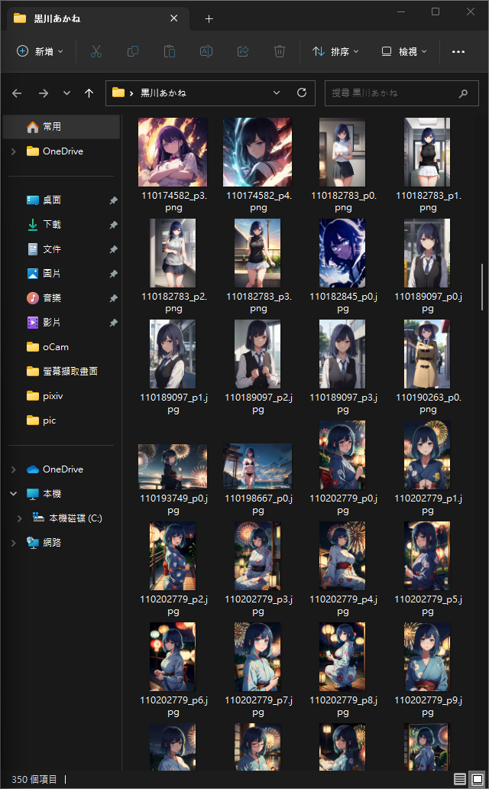
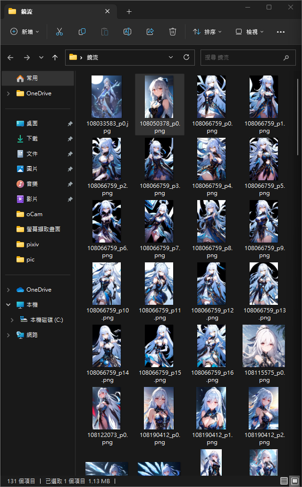


## 了解 AJAX 技術

我怕有人查完了還是看不懂 `AJAX` 到底是什麼，所以我就用自己的說法說明 `AJAX`：

`AJAX`（Asynchronous JavaScript and XML）是一種讓網頁變得更快、更順暢的技術。它能夠讓網頁在不需要整個重新載入的情況下，與伺服器交流資訊。這就像你在不中斷遊戲的情況下，跟朋友發短訊息一樣。採用 `AJAX` 這項技術網頁能夠在背後偷偷地和伺服器溝通，然後根據伺服器傳回的資訊，即時更新你所看到的內容。這讓網頁可以更迅速地顯示最新的資訊，而無需等待整個頁面重新載入。

## 選擇 Cookie 原因

在爬蟲領域，常見的實現方式包括使用 `Selenium` 和使用 `Cookie` 等。`Selenium` 可以模擬真實用戶的操作，包括填寫資料、點擊按鈕等，進而實現登入等複雜操作。然而儘管 `Selenium` 在模擬用戶行為方面十分有效，但它的使用也相對繁瑣，需要模擬整個瀏覽器環境，容易佔記憶體空間或其他不方便因素。相較之下使用 `Cookie` 的方式可以更加簡潔方便。`Cookie` 是網站用於識別用戶的數據，網站可以透過它來記住用戶的登入狀態等訊息。當提供了正確的 `Cookie`，我們可以進行認證，避免了模擬登入等複雜操作，同時也省下記憶體空間。這種方式特別適用於無需進行複雜交互的情況，也能夠使爬蟲更加高效地獲取所需數據。這就是我會選擇 `Cookie` 來爬取 `Pixiv` 資料的原因。

## 研究動機

1. 學習興趣愛好：對於程式設計和網頁爬蟲有濃厚的興趣的我，希望透過這個專案深入了解如何利用 `Python` 來獲取網站資源。

2. 提升實作能力：`Pixiv` 網站上匯集了大量精美的插畫作品。我希望透過這個專案，能夠讓大家學習到如何使用爬蟲技術來獲取插畫，同時也能夠在實作中提升爬蟲技能。

3. 深入了解網站：`Pixiv` 網站使用了大量的 `AJAX` 技術，這對於初學者來說可能會有一些挑戰。我希望透過這個專案，能夠讓大家深入理解 `AJAX` 技術的運作原理，並找到解決這些挑戰的方法。

## 製作過程

首先，您需要進入這個網站並進行登入操作，因為只有在登入後您才能夠獲取到更加完整的資料。下面是登入頁面的截圖：


成功登入後，即可開始使用搜尋功能來獲取插畫。該網站的搜尋功能採用基於標籤的查詢方式，您只需在搜尋欄中輸入您想查找的標籤，便可開始查詢相關作品。在本示例中，我們將使用「`鏡流`」作為我們的搜尋關鍵字，以便查詢相關訊息。在進行搜索後，您將會看到不同的分類，其中包括：

- 頂部（`top`）
- 插畫（`illustration`）
- 漫畫（`manga`）

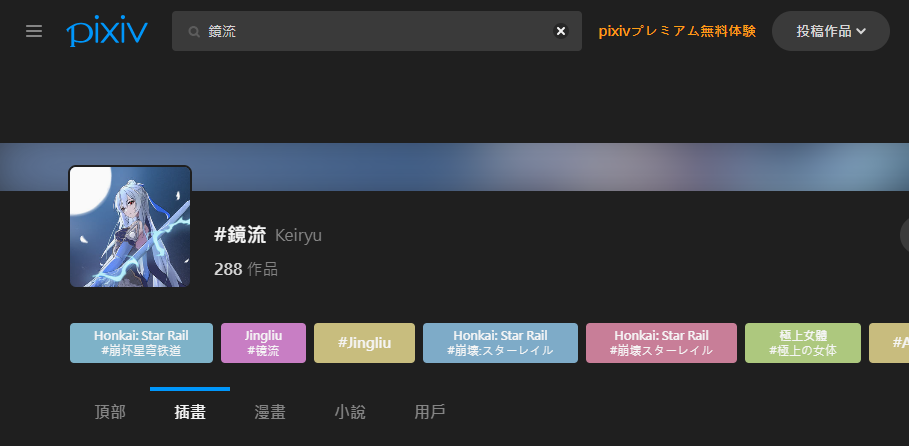

> <span style="color:pink">請注意，還有小說和用戶的部分，但基本上不會去爬這兩個</span>

在這一步中，我們選擇「`插畫`」這個分類。接著請按下鍵盤上的「`F12`」鍵來打開瀏覽器的開發者工具。由於這個網站使用了大量的 `AJAX` 技術，我們需要在開發者工具中做一些觀察來瞭解網頁與伺服器之間的數據交互。

在開發者工具中，請點擊「`Network`」（網絡）選項，然後再點擊「`Fetch/XHR`」（取回 / XMLHttpRequest）子選項。這些選項將可以讓我們查看網頁中的 `AJAX` 請求。

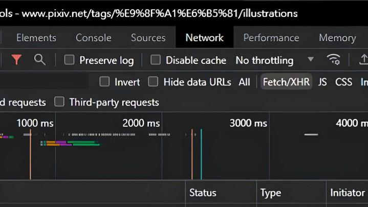

接下來可以使用「`CTRL + R`」快捷鍵來重新整理網頁。這樣做的目的是讓後續查詢資料時能夠更好找。

接下來我們將尋找與插畫（`illustration`）相關的資訊。我們希望找到是否有類似於 `https://www.pixiv.net/ajax/search/illustrations...` 這樣的網址，這個網址代表了與插畫相關的基本 `AJAX` 請求。

那麼問題來了，怎麼尋找我們要的請求網址？以下方法能夠幫助大家快速判別及了解我們需要的請求網址：

1. 英文標籤的情況：
    如果您在搜尋欄中填寫的標籤是英文的，我們要找的請求名稱通常會以用戶輸入的英文開頭來命名，並且對應著 `ASCII` 編碼。

    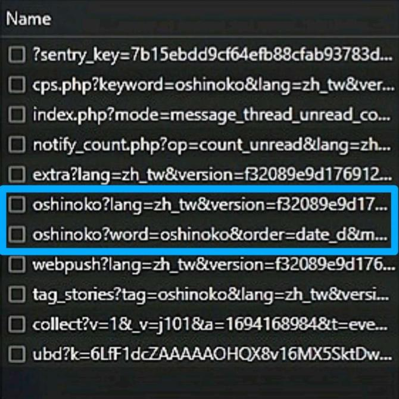

2. 非英文標籤的情況：
    如果您在搜尋欄中填寫的標籤是非英文的，我們要找的請求名稱通常會以百分比編碼的方式來命名。

    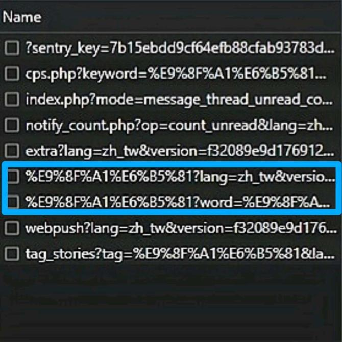

就是這麼簡單，透過標籤名稱我們可以迅速辨認出怎麼尋找相關的請求資訊。現在找到了兩個相似的名稱後，打開下面名稱並選擇「`Headers`」>「`General`」，可以看到「`Request URL`」這就是我們要的請求網址。

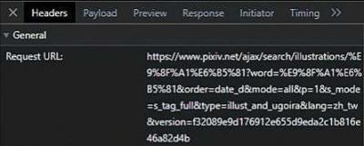

在我們進行 `Pixiv` 插畫搜尋時，系統會生成一個包含多個參數的網址。由於網址中可能包含一些特殊字元或非英文字符，為了在網絡傳輸中保持正確性，這些字符會被編碼。這就是為什麼我們看到的網址可能會像 `%E9%8F%A1%E6%B5%81` 這樣。

舉例來說，像我們搜尋的是「`鏡流`」，系統會將這個關鍵字編碼成 `%E9%8F%A1%E6%B5%81`，以確保在網址中的每個字符都可以正確地傳輸。我們可以使用 [URL Decode and Encode - Online](https://www.urldecoder.org/) 或其它解碼工具來進行解碼，將編碼後的網址解碼為人類可讀的形式。

經過解碼後，我們的網址從：
```
https://www.pixiv.net/ajax/search/illustrations/%E9%8F%A1%E6%B5%81?word=%E9%8F%A1%E6%B5%81&order=date_d&mode=all&p=1&s_mode=s_tag_full&type=illust_and_ugoira&lang=zh_tw&version=f32089e9d176912e655d9eda2c1b816e46a82d4b
```
變成了：
```
https://www.pixiv.net/ajax/search/illustrations/鏡流?word=鏡流&order=date_d&mode=all&p=1&s_mode=s_tag_full&type=illust_and_ugoira&lang=zh_tw&version=f32089e9d176912e655d9eda2c1b816e46a82d4b
```
然後我們點選「`payload`」，正常來說裡面會有 `7、8` 個資訊：

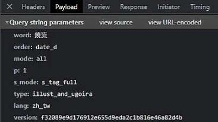

這些就是網址的一些參數，如果有正確地顯示參數我們就可以來寫一些 `code` 了。

我們可以使用 `pip` 工具來下載安裝 `requests` 庫。

```
pip install requests
```
導入必要模組：
```py
import json
import requests
```
接者我們可以定義了一個 `params` 字典，裡面我們可以存放 `Query string parameters` 整理好的的參數。(我看有人 `version` 沒放我這邊就不放了，似乎是不會影響搜尋結果的)
```py
params = {
    'word'   : '鏡流',
    'order'  : 'date_d',
    'mode'   : 'all',
    'p'      : '1',
    's_mode' : 's_tag_full',
    'type'   : 'illust_and_ugoira',
    'lang'   : 'zh_tw'
}
```

參數名稱    |解釋        |範例                                                                   |
-----------|-------------|----------------------------------------------------------------------|
`'word'`   | 搜尋關鍵字  | `'鏡流'`(表示搜索的是「鏡流」)                                         |
`'order'`  | 排序方式    | `'date_d'`(表示按照日期降序排列，即最新的內容會排在前面)                |
`'mode'`   | 搜索模式    | `'all'`(表示搜索所有類型的內容)                                        |
`'p'`      | 頁碼        | `'1'`(表示獲取第一頁的結果)                                           |
`'s_mode'` | 標籤模式    | `'s_tag_full'`(表示使用完整標籤進行搜索)                               |
`'type'`   | 內容類型    | `'illust_and_ugoira'`(表示搜索插畫和動圖)                             |
`'lang'`   | 語言設定    | `'zh_tw'`(表示繁體中文)                                               |

那因為我們是點選「`插畫`」分類，所以請求的網址會是 `https://www.pixiv.net/ajax/search/illustrations/` 開頭，如果是「`頂部`」的分類，就把 `illustrations` 替換為 `top` 就行了，以此類推。

然後要來請求網址內部資料，我們必須抓取 `JSON` 格式資料，使用 `requests.get` 發送GET請求，接著從回應中解析 `JSON` 格式的資料，最後將格式化的 `JSON` 資料印出，如下：
```py
url = 'https://www.pixiv.net/ajax/search/illustrations/' + params['word']
response = requests.get(url, params=params)

response_data = response.json()
formatted_data = json.dumps(response_data, sort_keys=True, indent=4, ensure_ascii=False)

print(formatted_data)
```

執行結果：

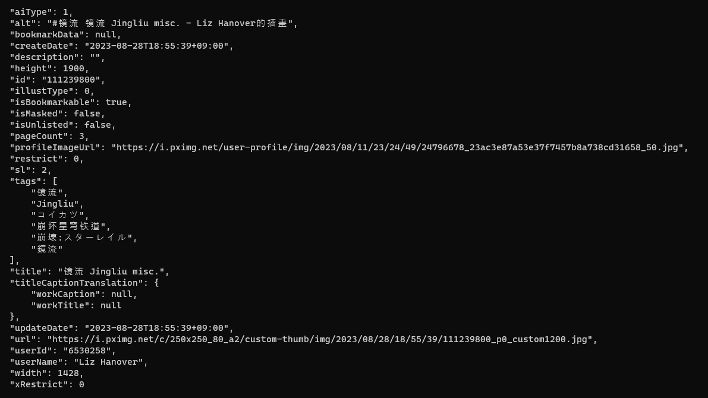

當我們繼續進行後續的步驟時，取得了每個插畫作品的唯一識別 `id`，將變得更加方便，這將在之後的程序中派上用場。在我們已經取得的 `JSON` 資料中，我們可以在以下位置找到這個 `id`：「`body`」 > 「`illust`」 > 「`data`」 > 「`(作品編號)`」 > 「`id`」。這個 `id` 將成為我們檢索作品相關資訊的關鍵。

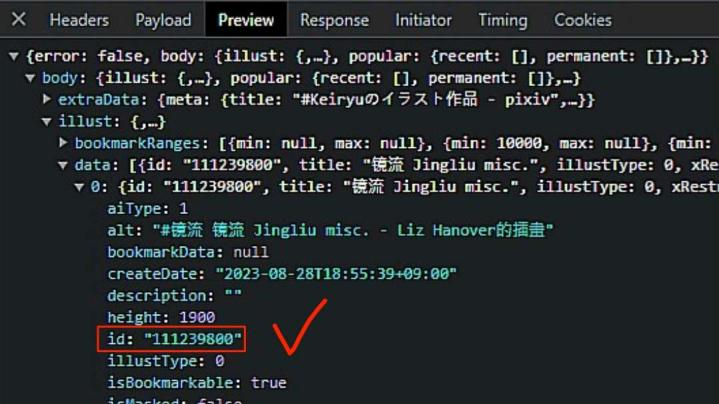

因為每個作品都有自己的ID，所以我們就直接用 `for` 迴圈來把每個作品ID都取下來：

```py
response = requests.get('https://www.pixiv.net/ajax/search/illustrations/' + params['word'] + '?', params = params)
data = response.json()

illustration_num = len(data["body"]["illust"]["data"])

for i in range(illustration_num):
    illustration_ID = data["body"]["illust"]["data"][i]["id"]
    print(illustration_ID)
```
這樣大致上就會印出第一頁的所有插畫 `id`，但是這樣會有個小問題，聰明的你們可能已經猜到了，沒錯，這個 `code` 居然沒有 `headers`，沒有 `headers` 就等於資料不全，我先給大家有 `headers` 請求的寫法：

```py
# 添加自定義標頭
headers = {
    'user-agent': # 放置你的 user-agent
    'cookie': # 放置你的 cookie
}

response = requests.get('https://www.pixiv.net/ajax/search/illustrations/' + params['word'] + '?', params = params, headers=headers) # 新增 headers 請求
data = response.json()
```

在上方我們在請求中加入了自定義的標頭，其中包括 `'user-agent'` 和 `'cookie'`。這樣可以模擬正常的瀏覽器請求，獲取完整的資料回應。最後透過 `response.json()` 解析回應的 `JSON` 資料，這樣就會獲得登入後的完整資訊。

以下是「未使用自定義標頭」和「使用自定義標頭」執行結果的對比圖示：

|未使用自定義標頭(未登入)                  |使用自定義標頭(已登入)                   |
|:--------------------------------------:|:--------------------------------------:|
|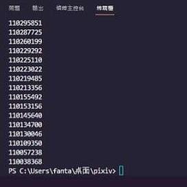|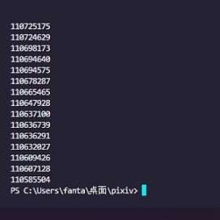|

這兩張都是最後顯示的結果，可以明顯看到兩者不同。因為每個插畫的連結都會是 `https://www.pixiv.net/artworks/{作品id}`， 所以接下來我們要將每個顯示的 `id` 改寫成這種連結

以下是修改後的寫法及執行結果：

```py
# 解析JSON格式的回應資料
data = response.json()

# 如果有搜尋結果，則提取每個插畫的連結
referer_list = []
for index, illust in enumerate(data["body"]["illust"]["data"]):
    illust_data = illust["id"]
    referer = "https://www.pixiv.net/artworks/" + illust_data
    referer_list.append(referer)

# 一行一行印出連結，並顯示總共有多少個連結
for index, referer in enumerate(referer_list, start=0):
    print(f"{index}. {referer}")

total_links = len(referer_list)
print(f"第 {params['p']} 頁總共有 {total_links} 個插圖連結")
```

這段程式碼的目的是從 `API` 回應資料中提取每個插畫的 `id`，並將每個 `ID` 轉換成對應的插畫連結。透過迴圈我們為每個插畫生成連結，然後印出這些連結以及總數。

完整獲取第一頁所有插畫連結程式碼如下：

```py
import json
import requests

# 設定搜尋參數
params = {
    'word'   : '鏡流',
    'order'  : 'date_d',
    'mode'   : 'all',
    'p'      : '1',
    's_mode' : 's_tag_full',
    'type'   : 'illust_and_ugoira',
    'lang'   : 'zh_tw'
}

# 構建請求URL並發送GET請求
url = 'https://www.pixiv.net/ajax/search/illustrations/' + params['word']

# 添加自定義標頭
headers = {
    'user-agent': # 放置你的 user-agent
    'cookie': # 放置你的 cookie
}

response = requests.get(url, params=params, headers=headers)

# 解析JSON格式的回應資料
data = response.json()

# 如果有搜尋結果，則提取每個插畫的連結
referer_list = []
for index, illust in enumerate(data["body"]["illust"]["data"]):
    illust_data = illust["id"]
    referer = "https://www.pixiv.net/artworks/" + illust_data
    referer_list.append(referer)

# 一行一行印出連結，並顯示總共有多少個連結
for index, referer in enumerate(referer_list, start=0):
    print(f"{index}. {referer}")

total_links = len(referer_list)
print(f"第 {params['p']} 頁總共有 {total_links} 個插圖連結")
```
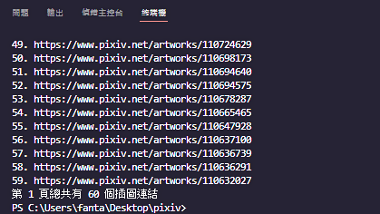

基本的架構和寫法已經完成，後續的內容大多是針對特定需求的修改和延伸。我們已經有了一些基礎，接下來只需要根據需求進行微調和擴充即可。

## ⬇️那剩下的都是寫好的程式碼做一點講解和整理，不會說得非常詳細(不然說不完QQ)⬇️
### pixiv_pages.py 完整程式碼分析整理

```py
import os
import requests

word = input("請輸入名稱(標籤)：")
start_page = int(input("請輸入起始頁數："))
end_page = int(input("請輸入結束頁數："))
custom_path = input("是否要自訂儲存路徑？(輸入 '是' 或 '否')：")

if custom_path == "是":
    download_folder = input("請輸入自訂儲存路徑：")
else:
    download_folder = input("請輸入自訂資料夾名稱：")
    desktop_path = os.path.expanduser(# 放置你的預設位置)
    download_folder = os.path.join(desktop_path, download_folder)

# 確保資料夾存在，如果不存在則創建資料夾
os.makedirs(download_folder, exist_ok=True)

for page_num in range(start_page, end_page + 1):
    params = {
        'word'   : word,
        'order'  : 'date_d',
        'mode'   : 'all',
        'p'      : page_num,
        's_mode' : 's_tag_full',
        'type'   : 'illust_and_ugoira',
        'lang'   : 'zh_tw'
    }

    response = requests.get('https://www.pixiv.net/ajax/search/illustrations/' + params['word'] + '?', params = params)
    data = response.json()

    num_illusts = len(data["body"]["illust"]["data"])

    for i, illust in enumerate(data["body"]["illust"]["data"]):
        illust_data = illust["id"]
        referer = "https://www.pixiv.net/artworks/" + illust_data
        print(f"第 {page_num} 頁_{i+1}：{referer}")

        # 獲取 referer
        referer = referer

        # 構造獲取 JSON 數據的 URL
        json_url = referer.replace("artworks", "ajax/illust") + "/pages?lang=zh_tw&version=f32089e9d176912e655d9eda2c1b816e46a82d4b"

        # 添加自定義標頭
        headers = {
            'user-agent': # 放置你的 user-agent
            'referer': referer,
            'cookie': # 放置你的 cookie
        }

        # 發送請求獲取 JSON 數據
        response = requests.get(json_url, headers=headers).json()

        # 檢查是否成功取得 JSON 資料
        pages = response["body"]
        for index, page in enumerate(pages):
            download_url = page["urls"]["original"]
            image_name = download_url.split("/")[-1].split(".")[0]  # 提取圖片名稱
            image_response = requests.get(download_url, headers=headers)
            if image_response.status_code == 200:
                image_data = image_response.content
                image_extension = os.path.splitext(download_url)[-1]  # 提取圖片擴展名
                image_filename = f"{image_name}{image_extension}"
                image_path = os.path.join(download_folder, image_filename)
                with open(image_path, "wb") as image_file:
                    image_file.write(image_data)
                print(f"{image_filename} 下載成功。")
            else:
                print(f"無法下載圖片 {image_name}。狀態碼: {image_response.status_code}")
```

1. 使用者輸入：
    ```py
    import os
    import requests

    word = input("請輸入名稱(標籤)：")
    start_page = int(input("請輸入起始頁數："))
    end_page = int(input("請輸入結束頁數："))
    custom_path = input("是否要自訂儲存路徑？(輸入 '是' 或 '否')：")
    ```
    導入必要模組，接著使用者在執行程式時，會被要求輸入名稱（標籤）、起始頁數、結束頁數和是否自訂儲存路徑。

2. 儲存路徑設定：
    ```py
    if custom_path == "是":
        download_folder = input("請輸入自訂儲存路徑：")
    else:
        download_folder = input("請輸入自訂資料夾名稱：")
        desktop_path = os.path.expanduser(# 放置你的預設位置)
        download_folder = os.path.join(desktop_path, download_folder)
    ```
    如果使用者輸入 `"是"` 就可以自訂儲存路徑，輸入 `"否"` 則會在預設的位置下建立一個資料夾。(預設位置也可以自訂)

3. 確保資料夾存在：
    ```py
    os.makedirs(download_folder, exist_ok=True)
    ```
    這一行程式碼確保指定的資料夾存在。如果資料夾已經存在，則不會進行任何操作。

4. 使用迴圈獲取頁數：
    ```py
    for page_num in range(start_page, end_page + 1):
        params = {
            'word'   : word,
            'order'  : 'date_d',
            'mode'   : 'all',
            'p'      : page_num,
            's_mode' : 's_tag_full',
            'type'   : 'illust_and_ugoira',
            'lang'   : 'zh_tw'
        }

        response = requests.get('https://www.pixiv.net/ajax/search/illustrations/' + params['word'] + '?', params = params)
        data = response.json()
    ```
    這部分程式碼運用了迴圈，逐一從「`起始頁數`」到「`結束頁數`」，發送請求以獲取每頁的搜尋結果。這些結果以 `JSON` 格式的資料返回，其中包含了我們所需要的插畫資訊。

5. 擷取插畫資訊並準備下載：
    ```py
    num_illusts = len(data["body"]["illust"]["data"])

    for i, illust in enumerate(data["body"]["illust"]["data"]):
        illust_data = illust["id"]
        referer = "https://www.pixiv.net/artworks/" + illust_data
        print(f"第 {page_num} 頁_{i+1}：{referer}")

        # 獲取 referer
        referer = referer

        # 構造獲取 JSON 數據的 URL
        json_url = referer.replace("artworks", "ajax/illust") + "/pages?lang=zh_tw&version=f32089e9d176912e655d9eda2c1b816e46a82d4b"

        # 添加自定義標頭
        headers = {
            'user-agent': # 放置你的 user-agent
            'referer': referer,
            'cookie': # 放置你的 cookie
        }

        # 發送請求獲取 JSON 數據
        response = requests.get(json_url, headers=headers).json()
    ```
    我們從搜尋結果的 `JSON` 資料中提取每個插畫的 `ID` 並準備下載。透過迴圈遍歷每個插畫資料，我們構建了包含插畫詳細資訊的 `URL`，並以自定義標頭向該 `URL` 發送請求以獲取插畫的 `JSON` 資料。

6. 下載圖片：
    ```py
    # 檢查是否成功取得 JSON 資料
    pages = response["body"]
    for index, page in enumerate(pages):
        download_url = page["urls"]["original"]
        image_name = download_url.split("/")[-1].split(".")[0]  # 提取圖片名稱
        image_response = requests.get(download_url, headers=headers)
        if image_response.status_code == 200:
            image_data = image_response.content
            image_extension = os.path.splitext(download_url)[-1]  # 提取圖片擴展名
            image_filename = f"{image_name}{image_extension}"
            image_path = os.path.join(download_folder, image_filename)
            with open(image_path, "wb") as image_file:
                image_file.write(image_data)
            print(f"{image_filename} 下載成功。")
        else:
            print(f"無法下載圖片 {image_name}。狀態碼: {image_response.status_code}")
    ```
    我們檢查之前獲取的 `JSON` 資料，以確保成功獲取插畫的詳細資訊。然後我們遍歷每個插畫的頁面，提取原始圖片的 `URL`，並使用自定義的標頭向該 `URL` 發送請求下載圖片資料。若回應狀態碼為 `200` 表示成功獲取圖片，再將圖片資料寫入指定的儲存路徑。若狀態碼不是 `200`，則顯示錯誤訊息。透過此步驟，完成對插畫的獲取和儲存。

### pixiv_random.py 完整程式碼分析整理

```py
import requests
import random

word = input("請輸入名稱(標籤)：")

referer_list = []  # 儲存所有找到的 referer

for random_page in range(1, 101):
    params = {
        'word': word,
        'order': 'date_d',
        'mode': 'all',
        'p': random_page,
        's_mode': 's_tag_full',
        'type': 'illust_and_ugoira',
        'lang': 'zh_tw'
    }

    # 添加自定義標頭
    headers = {
        'user-agent': # 放置你的 user-agent
        'cookie': # 放置你的 cookie
    }

    response = requests.get('https://www.pixiv.net/ajax/search/illustrations/' + params['word'] + '?', params=params, headers=headers)
    data = response.json()

    num_illusts = len(data["body"]["illust"]["data"])

    if num_illusts > 0:
        for illust in data["body"]["illust"]["data"]:
            illust_data = illust["id"]
            referer = "https://www.pixiv.net/artworks/" + illust_data
            referer_list.append(referer)

if referer_list:
    random_referer = random.choice(referer_list)
    print(f"隨機選擇的 referer：{random_referer}")
else:
    print("未找到符合條件的插畫作品。")
```

1. 使用者輸入名稱（標籤）：
    ```py
    import requests
    import random
    word = input("請輸入名稱(標籤)：")
    ```
    導入必要模組，接著使用者會被提示輸入搜尋的名稱或標籤，例如「`鏡流`」。

2. 初始化 `referer_list` 列表，用於儲存找到的插畫作品連結：
    ```py
    referer_list = []
    ```


3. 進行 100 個頁面的循環，每次搜尋並處理一個頁面的插畫作品：
    ```py
    for random_page in range(1, 101):
    ```

4. 設定搜尋參數，其中 `random_page` 是當前的頁數：
    ```py
    params = {
        'word': word,
        'order': 'date_d',
        'mode': 'all',
        'p': random_page,
        's_mode': 's_tag_full',
        'type': 'illust_and_ugoira',
        'lang': 'zh_tw'
    }
    ```

5. 添加自定義標頭，以模擬瀏覽器請求：
    ```py
    headers = {
        'user-agent': # 放置你的 user-agent
        'cookie': # 放置你的 cookie
    }
    ```

6. 發送 `GET` 請求，獲取 `JSON` 格式的回應資料：
    ```py
    response = requests.get('https://www.pixiv.net/ajax/search/illustrations/' + params['word'] + '?', params=params, headers=headers)
    data = response.json()
    ```

7. 檢查回應資料中插畫作品的數量：
    ```py
    num_illusts = len(data["body"]["illust"]["data"])
    ```

8. 如果有找到插畫作品，則提取每個插畫的 `id` 並構建連結，將連結加入到 `referer_list` 中：
    ```py
    if num_illusts > 0:
        for illust in data["body"]["illust"]["data"]:
            illust_data = illust["id"]
            referer = "https://www.pixiv.net/artworks/" + illust_data
            referer_list.append(referer)
    ```

9. 循環完所有頁面後，檢查是否找到了符合條件的插畫作品連結，然後從 `referer_list` 中隨機選擇一個連結並印出：
    ```py
    if referer_list:
        random_referer = random.choice(referer_list)
        print(f"隨機選擇的 referer：{random_referer}")
    else:
        print("未找到符合條件的插畫作品。")
    ```

### pixiv_url.py 完整程式碼分析整理

```py
import os
import requests

# 判斷下載單個作品還是多個作品
choice = input("要下載單一作品還是多個作品？(輸入 '單一' 或 '多個')：")

if choice == "單一":
    referer = input("請輸入作品網址：")

    # 構造獲取 JSON 數據的 URL
    json_url = referer.replace("artworks", "ajax/illust") + "/pages?lang=zh_tw&version=f32089e9d176912e655d9eda2c1b816e46a82d4b"

    # 添加自定義標頭
    headers = {
        'user-agent': # 放置你的 user-agent
        'cookie': # 放置你的 cookie
    }

    custom_path = input("是否要自訂儲存路徑？(輸入 '是' 或 '否')：")
    if custom_path == "是":
        download_folder = input("請輸入儲存路徑：")
    else:
        download_folder = input("請輸入資料夾名稱：")
        desktop_path = os.path.expanduser(# 放置你的預設位置)
        download_folder = os.path.join(desktop_path, download_folder)

    os.makedirs(download_folder, exist_ok=True)

    response = requests.get(json_url, headers=headers).json()

    pages = response["body"]
    for index, page in enumerate(pages):
        download_url = page["urls"]["original"]
        image_name = download_url.split("/")[-1].split(".")[0]
        image_response = requests.get(download_url, headers=headers)
        if image_response.status_code == 200:
            image_data = image_response.content
            image_extension = os.path.splitext(download_url)[-1]
            image_filename = f"{image_name}{image_extension}"
            image_path = os.path.join(download_folder, image_filename)
            with open(image_path, "wb") as image_file:
                image_file.write(image_data)
            print(f"{image_filename} 下載成功。")
        else:
            print(f"無法下載圖片 {image_name}。狀態碼: {image_response.status_code}")

elif choice == "多個":
    num_works = int(input("請輸入要下載的作品數量："))
    
    works_info = []

    for i in range(num_works):
        referer = input(f"請輸入第 {i+1} 個作品的網址：")
        works_info.append(referer)

    same_path = input("是否要所有作品都儲存於相同路徑？(輸入 '是' 或 '否')：")
    if same_path == "是":
        custom_path = input("請輸入儲存路徑：")
    else:
        custom_path = "否"

    for i, referer in enumerate(works_info):
        print("=" * 50)
        print(f"處理第 {i+1} 個作品：")
        # 構造獲取 JSON 數據的URL
        json_url = referer.replace("artworks", "ajax/illust") + "/pages?lang=zh_tw&version=f32089e9d176912e655d9eda2c1b816e46a82d4b"

        # 添加自定義標頭
        headers = {
            'user-agent': # 放置你的 user-agent
            'cookie': # 放置你的 cookie
        }

        if custom_path == "否":
            download_folder = input("請輸入資料夾名稱：")
            desktop_path = os.path.expanduser(# 放置你的預設位置)
            download_folder = os.path.join(desktop_path, download_folder)
        else:
            download_folder = custom_path

        os.makedirs(download_folder, exist_ok=True)

        response = requests.get(json_url, headers=headers).json()

        pages = response["body"]
        for index, page in enumerate(pages):
            download_url = page["urls"]["original"]
            image_name = download_url.split("/")[-1].split(".")[0]
            image_response = requests.get(download_url, headers=headers)
            if image_response.status_code == 200:
                image_data = image_response.content
                image_extension = os.path.splitext(download_url)[-1]
                image_filename = f"{image_name}{image_extension}"
                image_path = os.path.join(download_folder, image_filename)
                with open(image_path, "wb") as image_file:
                    image_file.write(image_data)
                print(f"{image_filename} 下載成功。")
            else:
                print(f"無法下載圖片 {image_name}。狀態碼: {image_response.status_code}")
else:
    print("輸入無效選擇。")
```


1. 使用者選擇要下載的作品類型：
    ```py
    choice = input("要下載單一作品還是多個作品？(輸入 '單一' 或 '多個')：")
    ```

2. 如果選擇下載單一作品，使用者需要輸入作品的網址：
    ```py
    referer = input("請輸入作品網址: ")
    ```

3. 構造獲取 `JSON` 數據的 `URL：`
    ```py
    json_url = referer.replace("artworks", "ajax/illust") + "/pages?lang=zh_tw&version=f32089e9d176912e655d9eda2c1b816e46a82d4b"
    ```

4. 設定請求標頭（headers），包括 User-Agent、Referer 和 Cookie：
    ```py
    headers = {
        'user-agent': # 放置你的 user-agent
        'referer': referer,
        'cookie': # 放置你的 cookie
    }
    ```

5. 使用者可以選擇自訂儲存路徑，如果是，則輸入儲存路徑；否則，輸入資料夾名稱，並在桌面創建對應的資料夾：
    ```py
    custom_path = input("是否要自訂儲存路徑？(輸入 '是' 或 '否')：")
    if custom_path == "是":
        download_folder = input("請輸入儲存路徑：")
    else:
        download_folder = input("請輸入資料夾名稱：")
        desktop_path = os.path.expanduser(# 放置你的預設位置)
        download_folder = os.path.join(desktop_path, download_folder)
    ```

6. 建立儲存路徑的資料夾：
    ```py
    os.makedirs(download_folder, exist_ok=True)
    ```

7. 通過 `JSON URL` 發送請求並獲取 `JSON` 回應資料：
    ```py
    response = requests.get(json_url, headers=headers).json()
    ```

8. 從回應資料中獲取每個圖片頁面的資料，然後下載並儲存到指定路徑：
    ```py
        pages = response["body"]
        for index, page in enumerate(pages):
            download_url = page["urls"]["original"]
            image_name = download_url.split("/")[-1].split(".")[0]
            image_response = requests.get(download_url, headers=headers)
            if image_response.status_code == 200:
                image_data = image_response.content
                image_extension = os.path.splitext(download_url)[-1]
                image_filename = f"{image_name}{image_extension}"
                image_path = os.path.join(download_folder, image_filename)
                with open(image_path, "wb") as image_file:
                    image_file.write(image_data)
                print(f"{image_filename} 下載成功。")
            else:
                print(f"無法下載圖片 {image_name}。狀態碼: {image_response.status_code}")
    ```

9. 如果選擇下載多個作品，使用者需要輸入要下載的作品數量，以及每個作品的網址：
    ```py
    num_works = int(input("請輸入要下載的作品數量："))
    works_info = []
    for i in range(num_works):
        referer = input(f"請輸入第 {i+1} 個作品的網址：")
        works_info.append(referer)
    ```

10. 使用者可以選擇是否將所有作品都儲存在相同的路徑，如果是，則輸入儲存路徑，否則將使用原始的資料夾名稱：
    ```py
    same_path = input("是否要所有作品都儲存於相同路徑？(輸入 '是' 或 '否')：")
    if same_path == "是":
        custom_path = input("請輸入儲存路徑：")
    else:
        custom_path = "否"
    ```

11. 根據每個作品的資訊，循環處理每個作品的下載：
    ```py
    for i, referer in enumerate(works_info):
        print("=" * 50)
        print(f"處理第 {i+1} 個作品：")
        # 構造獲取 JSON 數據的URL
        json_url = referer.replace("artworks", "ajax/illust") + "/pages?lang=zh_tw&version=f32089e9d176912e655d9eda2c1b816e46a82d4b"

        headers = {
            'user-agent': # 放置你的 user-agent
            'referer': referer,
            'cookie': # 放置你的 cookie
        }

        if custom_path == "否":
            download_folder = input("請輸入資料夾名稱：")
            desktop_path = os.path.expanduser(# 放置你的預設位置)
            download_folder = os.path.join(desktop_path, download_folder)
        else:
            download_folder = custom_path

        os.makedirs(download_folder, exist_ok=True)

        response = requests.get(json_url, headers=headers).json()

        pages = response["body"]
        for index, page in enumerate(pages):
            download_url = page["urls"]["original"]
            image_name = download_url.split("/")[-1].split(".")[0]
            image_response = requests.get(download_url, headers=headers)
            if image_response.status_code == 200:
                image_data = image_response.content
                image_extension = os.path.splitext(download_url)[-1]
                image_filename = f"{image_name}{image_extension}"
                image_path = os.path.join(download_folder, image_filename)
                with open(image_path, "wb") as image_file:
                    image_file.write(image_data)
                print(f"{image_filename} 下載成功。")
            else:
                print(f"無法下載圖片 {image_name}。狀態碼: {image_response.status_code}")
    ```

12. 如果使用者未輸入有效選擇，則輸出「`輸入無效選擇。`」：
    ```py
    else:
        print("輸入無效選擇。")
    ```

## 實作心得

這次的 `Pixiv` 爬蟲實作算是告一段落了，我自己也在學習過程中常看不懂其他人怎麼寫出來了，一下子是舊版寫法、一下子解釋得很模糊不清，所以後來幾乎都是自己慢慢研究爬蟲這塊，除了是給自己提升一點觀念和實作基礎，但我想這篇也許能夠幫助到更多需要的人。

雖然碰到了些許困難，但自己摸索和解決的過程讓我更有成就感。我也明白到網頁爬蟲領域是不斷變化的，隨著網站結構和政策的更新，需要不斷地學習和調整自己的方法。

這次的經驗不僅提升了我的編程技能，更讓我學會如何處理複雜的資料結構、處理不同格式的數據，以及如何與網站互動。特別是在實作過程中我深入了解了如何透過 `AJAX` 請求來取得網站的資料，並且理解了網站如何使用 `JSON` 格式來傳遞數據。

同樣地，寫爬蟲第一次會需要使用 `cookie` 登入的情況，但這也是一個非常實用的技巧，我能夠使用 `cookie` 來模擬用戶登入狀態，從而獲取到完整的數據。綜合來看，這次的實作不僅加強了我的編程和爬蟲技能，還拓展了我的資料處理能力和與網站互動的經驗。

此外，撰寫這篇 `README` 也是對我有很大幫助，學會如何清晰地表達自己的思想，以及如何用最簡單的方式解釋複雜的概念。

雖然程式比較簡陋且沒有做成 `GUI` 或 `EXE` 檔等等，但這也是學習過程中的一部分，如果有空的話會考慮進一步改進這個爬蟲程式，讓它更加完善和便利。

## 參考資料

- https://home.gamer.com.tw/creationDetail.php?sn=4817720
- https://blog.51cto.com/aiyc/2933316
- https://github.com/bill6315/pixiv_get

## 授權訊息

這個程式遵循 [MIT 授權](LICENSE.txt)，您可以自由地使用、修改和分發這個程式。